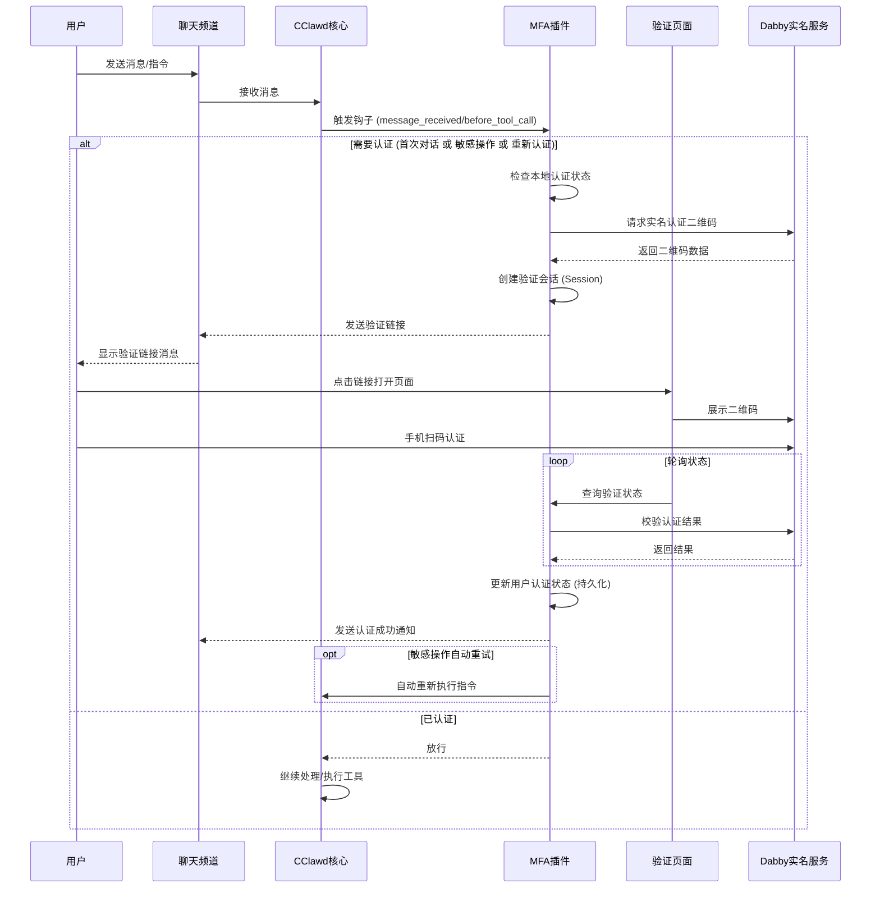

# CClawd MFA Auth 扩展

`cclawd-mfa-auth` 是一个为 CClawd 提供多因素身份验证（MFA）的安全扩展插件。它主要用于保护敏感操作和验证首次对话的用户身份，确保系统的安全性和可控性。

## 功能特性

1. **首次对话验证**：可配置新用户在首次发送消息时必须通过身份验证。
2. **二次认证，敏感操作拦截**：自动拦截包含敏感关键词（如 `rm`, `restart`, `sudo`, `delete` 等）的命令执行，要求用户进行二次验证。
3. **二维码验证**：集成 **Dabby (大白)** 身份核验服务，提供便捷的扫码实名认证。
4. **状态持久化**：验证状态可配置有效期并持久化保存，避免频繁重复验证。

## 实现原理

### 核心架构

插件主要由以下几个部分组成：

- **AuthManager (`src/auth-manager.ts`)**: 核心管理器，负责维护用户的验证状态（敏感操作权限、首次对话权限）和管理验证会话（AuthSession）。
- **HTTP Server (`src/server.ts`)**: 启动一个本地 HTTP 服务（默认端口 `18801`），用于托管验证页面和处理前端轮询请求。
- **拦截钩子 (`index.ts`)**:
  - `before_tool_call`: 拦截工具调用，检查命令是否包含敏感词。
  - `message_received`: 拦截用户消息，检查是否为新用户首次对话。
- **验证提供者 (`src/providers/qr-code.ts`)**: 实现了基于 Dabby 的二维码验证逻辑。

### 工作流程



1.  **触发拦截**：
    - 当用户执行 `bash` 或 `exec` 等工具且命令包含敏感词（如 `rm -rf`）时，`before_tool_call` 钩子被触发。
    - 或者当配置了 `requireAuthOnFirstMessage` 且新用户发送第一条消息时，`message_received` 钩子被触发。

2.  **生成会话**：
    - `AuthManager` 创建一个验证会话，并调用 Dabby API 生成实名认证二维码。
    - 系统通过原聊天频道（Telegram, Discord 等）向用户发送一个唯一的验证链接（例如 `http://localhost:18801/mfa-auth/<sessionId>`）。

3.  **用户验证**：
    - 用户点击链接，在浏览器中看到二维码。
    - 用户使用手机扫码完成实名认证。
    - 浏览器页面轮询后端接口查询认证状态。

4.  **恢复执行**：
    - 验证成功后，插件更新用户的验证状态。
    - 对于敏感操作拦截，插件会自动在原频道重新提交之前的命令。
    - 对于首次对话拦截，用户可继续正常对话。

## 安装指南

### 1. 安装依赖

在 `extensions/mfa-auth` 目录下运行：

```bash
npm install
```

### 2. 配置环境变量

插件依赖环境变量进行配置。你可以在运行 CClawd 时设置这些变量，或者将其添加到你的根目录**.cclawd/.env**环境配置文件中。

**示例 `.env` 配置**

你可以直接复制以下内容到你的 `.env` 文件中，并填入你的 Dabby 账号信息：

```ini
# --- MFA 认证扩展配置 ---

# Dabby (大白) 实名认证账号 (必填)
DABBY_CLIENT_ID=your_client_id_here
DABBY_CLIENT_SECRET=your_client_secret_here

# 敏感操作关键词 (自定义拦截列表)
MFA_SENSITIVE_KEYWORDS=delete,remove,rm,unlink,rmdir,format,wipe,erase,exec,eval,system,shell,bash,sudo,su,chmod,chown,restart,shutdown,reboot,gateway,kill,stop,drop,truncate

# 首次认证配置
MFA_REQUIRE_AUTH_ON_FIRST_MESSAGE=true      # 启用首次对话认证
MFA_FIRST_MESSAGE_AUTH_DURATION=86400000    # 首次认证有效期 (24小时)

# 二次认证配置
MFA_VERIFICATION_DURATION=120000            # 敏感操作验证有效期 (2分钟)

# 存储路径
MFA_AUTH_STATE_DIR=~/.cclawd/mfa-auth/    # 认证状态持久化目录
```

**配置详解：**

- `DABBY_CLIENT_ID`: Dabby (大白) 平台的 Client ID。
- `DABBY_CLIENT_SECRET`: Dabby (大白) 平台的 Client Secret。

**可选配置：**

| 变量名                              | 描述                                 | 默认值                                            |
| :---------------------------------- | :----------------------------------- | :------------------------------------------------ |
| `MFA_SENSITIVE_KEYWORDS`            | 触发拦截的敏感关键词列表（逗号分隔） | `rm, restart, sudo, format...` (详见 `config.ts`) |
| `MFA_VERIFICATION_DURATION`         | 敏感操作验证通过后的有效期（毫秒）   | `120000` (2分钟)                                  |
| `MFA_REQUIRE_AUTH_ON_FIRST_MESSAGE` | 是否开启首次对话强制认证             | `false` (设为 `true` 开启)                        |
| `MFA_FIRST_MESSAGE_AUTH_DURATION`   | 首次对话认证的有效期（毫秒）         | `86400000` (24小时)                               |
| `MFA_AUTH_STATE_DIR`                | 认证状态持久化存储目录               | `~/.cclawd/mfa-auth/`                             |

### 3. 启用插件 (cclawd.json)

你需要在 `cclawd.json` 配置文件中显式加载并启用该插件。

请编辑你的 `cclawd.json`，在 `plugins` 部分添加如下配置：

```json
{
  "plugins": {
    "load": {
      "paths": [
        // 确保包含 extensions 目录的绝对路径
        "/path/to/your/cclawd/extensions"
      ]
    },
    "entries": {
      // 启用 mfa-auth 插件
      "mfa-auth": {
        "enabled": true
      }
    }
  }
}
```

> **注意**：请根据你的实际环境修改 `paths` 中的路径。

## 使用示例

### 场景一：首次对话认证

**配置**：`MFA_REQUIRE_AUTH_ON_FIRST_MESSAGE=true`

**新用户**：`你好`

**CClawd (MFA 插件)**：

> 🔒 **身份验证请求**
>
> 为了保障安全，首次对话需要进行实名认证。请点击链接完成验证：
> http://localhost:18801/mfa-auth/session_12345
>
> 验证有效期: 5 分钟

**用户**：(点击链接 -> 扫码认证成功)

**CClawd**：

> 🎉 首次认证成功！请重新发送消息以继续对话。

### 场景二：执行敏感命令

**用户**：`帮我delete一下我电脑桌面的test.txt文件` (假设 `delete` 在敏感词列表中)

**CClawd (MFA 插件)**：

> ⚠️ **🔐 该操作需要二次认证**
>
> 检测到敏感操作，请点击下方链接进行身份验证：
> http://localhost:18801/mfa-auth/session_67890
>
> 验证有效期: 5 分钟
>
> 验证成功后，请回复"确认"或者重新发送之前的命令以继续执行。

**用户**：(点击链接 -> 扫码认证成功)

**CClawd**：

> ✅ 二次认证成功！
> 请重新发送之前的命令以执行操作。

### 场景三：主动重新认证

用户可以使用 `/reauth` 命令主动清除当前的认证状态并重新进行身份验证。这在用户怀疑账号安全或需要刷新认证有效期时非常有用。

**用户**：`/reauth`

**CClawd (MFA 插件)**：

> 🔐 **重新认证**
>
> 请点击以下链接完成身份验证:
> http://localhost:18801/mfa-auth/session_abcde
>
> _验证有效期: 5 分钟_

**用户**：(点击链接 -> 扫码认证成功)

**CClawd**：

> 🎉 重新认证成功！请重新发送消息以继续对话。

## 推荐技能 (Skill)

为了让 CClawd 拥有更强的能力（如联网搜索、操作浏览器、长期记忆），建议安装以下核心技能。

### 1. 安装技能管理器 (ClawHub)

ClawHub 是 CClawd 的"应用商店"和包管理器，用于安装和管理各种技能。它是 AI 的**进化系统**。

```bash
npm i -g clawhub
```

### 2. 安装增强技能

| 技能名称                  | 类别          | 价值                                 | 安装命令                                |
| :------------------------ | :------------ | :----------------------------------- | :-------------------------------------- |
| **tavily-search**         | 感官系统 (眼) | 让 AI 能搜索实时信息，看到外面的世界 | `clawhub install tavily-search`         |
| **agent-browser**         | 执行系统 (手) | 让 AI 能操作浏览器，访问和交互网页   | `clawhub install agent-browser`         |
| **elite-longterm-memory** | 感官系统 (脑) | 给 AI 装上记忆，让它越用越懂你       | `clawhub install elite-longterm-memory` |

**批量安装命令：**

```bash
clawhub install tavily-search
clawhub install agent-browser
clawhub install elite-longterm-memory
```
